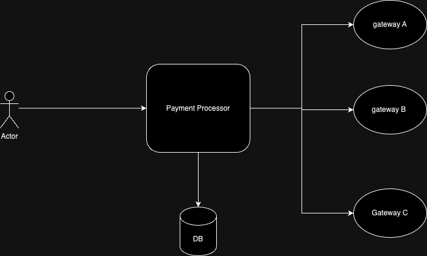

# Go Payment Processor

This project is a simple payment processing application written in Go. It provides basic functionalities to handle payment transactions accross different payment gateways.

## Features

- Ability to manage multiple payment gateways seamlessly
- Supports multiple data formats (JSON, XML) integration over HTTP
- Flexible data model layer to incorporate all popular databases (SQL Server, Postgres, MySQL)

## Architecture Overview

- The service exposes 2 transaction endpoints to be consumed on the client side (Deposit, Withdrawal) which can be used to make account deposits and withdrawals
- The service also exposes 1 endpoint for gateways to consume for asynchronous transaction updates (reversal)
- The service implements the driving and driven architecture as the PaymentHandler initiates the request to the service layer and the service layer invokes the gateway (driven)
- The gatewayIdentifier service identifies which gateway should be the request initiated based on which the customer is registered.
- The database of choice is Postgres but the DB layer function can be easily extended to support other DBs as the implementation is dictated by interfaces.



## Setup Guide

- Clone the repository `git@github.com:wadeed-deriv/go-payment-processor.git`
- Go to the cloned directory `go-payment-processor`
- Inside the repo do `cd test-server` and run `npm i` (make sure you have `node` and `npm` installed on the system)
- Afterward run `node index.js` this will start the mock gateway server 
- Open a new terminal and go to the project directory 
- If you are on linux you need to open the `docker-compose.yml` file located on the root of `go-payment-processor` directory
- replace the `http://host.docker.internal` to the ip of the system for `GATEWAY_A_URL` and `GATEWAY_A_URL` env variable
- Now in the terminal enter `docker-compose up app -d`
- This will create and run 2 container, Postgres db container which will have the database already initialize in it through script `dbscript\init.sql`
- The other container will be the payment process App container exposing server on `localhost:8080`
- You can start interacting with the Api now. 

## API Documentation

- Please paste the below openapi specifications in `editor.swagger.io` 
```
openapi: 3.0.1
info:
  title: Payment API
  description: API for deposit, withdrawal, and update operations.
  version: "1.0.0"
paths:
  /deposit:
    post:
      summary: Deposit funds into the user's account
      requestBody:
        description: Deposit request body
        required: true
        content:
          application/json:
            schema:
              type: object
              properties:
                id:
                  type: string
                  description: Unique identifier of the user
                  example: "1"
                amount:
                  type: number
                  description: Amount to deposit
                  example: 1000
      responses:
        '200':
          description: Successfully deposited funds
          content:
            application/json:
              schema:
                type: object
                properties:
                  success:
                    type: boolean
                    example: true
                  message:
                    type: string
                    example: "Deposit successful"

  /withdrawal:
    post:
      summary: Withdraw funds from the user's account
      requestBody:
        description: Withdrawal request body
        required: true
        content:
          application/json:
            schema:
              type: object
              properties:
                id:
                  type: string
                  description: Unique identifier of the user
                  example: "1"
                amount:
                  type: number
                  description: Amount to withdraw
                  example: 1000
      responses:
        '200':
          description: Successfully withdrew funds
          content:
            application/json:
              schema:
                type: object
                properties:
                  success:
                    type: boolean
                    example: true
                  message:
                    type: string
                    example: "Withdrawal successful"

  /update:
    post:
      summary: Update transaction details
      requestBody:
        description: Update request body
        required: true
        content:
          application/json:
            schema:
              type: object
              properties:
                id:
                  type: string
                  description: Unique identifier of the user
                  example: "1"
                amount:
                  type: number
                  description: Amount for the transaction
                  example: 1000
                transactiontype:
                  type: string
                  description: Type of transaction (DEPOSIT/WITHDRAWAL)
                  example: "DEPOSIT"
      responses:
        '200':
          description: Successfully updated transaction
          content:
            application/json:
              schema:
                type: object
                properties:
                  success:
                    type: boolean
                    example: true
                  message:
                    type: string
                    example: "Transaction updated successfully"
```

## Adding a new Gateway 

- First we need to include a new gateway entry in database like `ALTER TYPE gateway ADD VALUE 'C';`
- Add an entry in `internal/application/gatewayidenitifer.go` like :
```
case "C":
	return paymentgatewayC.NewPaymentGateway()
```
- create a directory in `internal/adapter/driven`. in the newly created directory create a file `paymentgateway.go` then implement the below interface in the code file 
```
type PaymentGateway interface {
	Deposit(ctx context.Context, paymentdetail *entities.PaymentDetail) error
	Withdrawal(ctx context.Context, paymentdetail *entities.PaymentDetail) error
}
```
- Include the `new_gateway_url` in docker-compose in app -> environment file like 
```
NEW_GATEWAY_URL=http://host.docker.internal:3000/new
```
- Rebuild the docker container. 

## Run Test 
- Run the following command in the root of the service repository
```
 go test ./...
 ```
 - Or for individual result run the following command
 ```
 go test /internal/adapter/driving/htthandler/paymenthandler_test.go
 go test /internal/application/paymentservice_test.go
 go test /internal/db/paymentrepository_test.go
 ```

## Scaling up the solution

- Easiest way to scale the service is have multiple app docker container running behind a load balancer can use nginx reverse proxy.
- Implementing Queue buffering on gateway endpoint to not overwhelm gateway and control the request flow.
- Implementing Queue buffering on the async webhook `/update` as a lot of merchant reconciliation happens on night time that might overwhelm the webhook and our service.
- Kubernetes deployment on cloud (GCP, AWS) auto scaling 